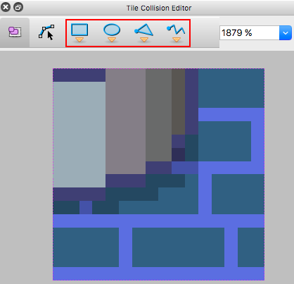

# haxeflixel-tiled-tile-objects-demo

This is a demo for Adding Support for Tiled Collision Editor to HaxeFlixel.

HaxeFlixel/Flixel-addons issue: [316](https://github.com/HaxeFlixel/flixel-addons/issues/316)

### Use Case

This feature will add objects to tiles which were created in the Tile Collision Editor in Tiled. The objects can be used for collisions, or anything else a developer wants.

  
*Objects added to tiles, drawn in HaxeFlixel debugger*

### In Tiled Editor

To add objects to tiles in Tiled Editor:

1. Select **Edit Tileset**  

2. Select a Tile to edit
3. Select an object type from **Tile Collision Editor**  

4. Draw objects on the tile  

5. Optionally alter or set the object properties from **Properties**  
